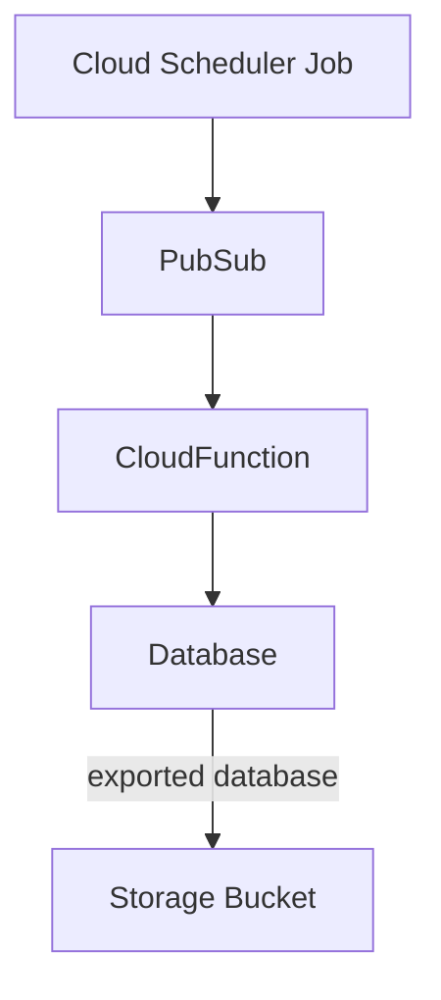

# Cloud SQL Backup Module

This directory contains a Terraform Module that is intended to create a serverless backup solution for a single Google Cloud SQL Database.

[[_TOC_]]

## Module Contents

This module deploys the following GCP resources:

- PubSub Topic used as a CloudFunction trigger
- CloudFunction triggered via PubSub events, triggers a database export to the backup bucket
- Cloud Scheduler Job that invokes the PubSub topic connected to the backup CloudFunction
- If an existing bucket isn't passed in, a Storage Bucket will be created to house database exports
- Roles applied to ServiceAccounts used in the backup process

## Cloud SQL Backup Solution Architectural Diagram



### Prerequisites

- Google Project to install resources and house Database dumps with the following apis enabled:
  - `cloudfunctions.googleapis.com`
  - `pubsub.googleapis.com`
  - `cloudscheduler.googleapis.com`
  - `cloudbuild.googleapis.com`
  - `sqladmin.googleapis.com`
- ServiceAccount with `roles/cloudsql.editor` assigned

### Usage

Declare a module like below

```terraform
module "artifactory_backups" {
  source                        = "../modules/cloud-sql-backup" # or wherever the module lives currently
  backups_resource_project_id   = "" # project_id created in the prerequisite phase
  location                      = "" # region to host resources
  database_name                 = "" # name of the database to backup
  cloudfunction_service_account = "" # service account to apply to the backup CloudFunction
  database_instance             = "" # name of the database instance that contains the target database
  database_project_id           = "" # project that contains the database
  schedule                      = "" # cron schedule to run the backup: default => 0 0 * * 4
  max_backup_age_days           = "" # max days to keep backups: default => 365
  backups_bucket                = "" # bucket to export backups to, will create one if not specified
}
```

The database's backup path will be output by the `application_backup_bucket_url` module output. Example usage in pipeline output:

```terraform
  backup_paths = {
      artifactory     = module.artifactory_sql_backups.application_backup_bucket_url
      mission_control = module.mission_control_sql_backups.application_backup_bucket_url
      xray            = module.xray_sql_backups.application_backup_bucket_url
    }
```

### Example

```terraform
module "artifactory_backups" {
  source                        = "../modules/cloud-sql-backup"
  backups_resource_project_id   = google_project_service.jfrog_backups["cloudscheduler.googleapis.com"].project
  location                      = local.region
  database_name                 = google_sql_database.artifactory.name
  cloudfunction_service_account = google_service_account.jfrog_backups.email
  database_instance             = google_sql_database_instance.artifactory.name
  database_project_id           = google_project.strong_bad.project_id
  schedule                      = "0 0 * * 4"
  max_backup_age_days           = 365
  backups_bucket                = local.bootstrap.backups_bucket
}
```

### Restoring a Database From Backup Data

In order to restore a Cloud SQL database from a backup, select a snapshot and run a command like below.

```bash
gcloud sql import sql instance-name gs://backup-bucket/backup-file.sql.gz --database=database-name
```

Reference [documentation](https://cloud.google.com/sdk/gcloud/reference/sql/import/sql) for more information.
